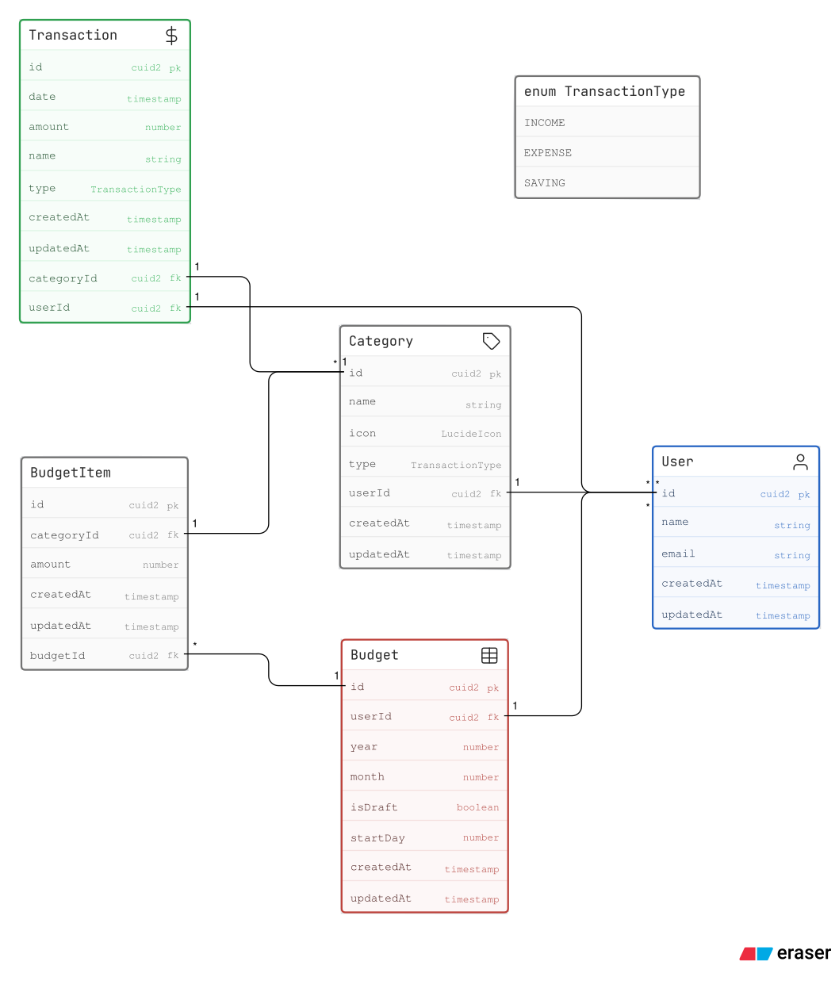

# TDDD27 - Tjugofem

## 1. Project Overview

- **Concept:** A personal finance tracker designed to help students and young adults manage their spending habits. Users can log their transactions, categorize expenses, and set monthly budgets to gain insights into their financial health.
- **Target Audience:** Students and young adults
- **Core Problem:** Personal finance data and transactions are spread out over different banking systems and platforms, making it difficult to overview your spending habits.

  Some banks offer this functionality. However, their tool automatization narrows down the functionality, leaving the user with not enough control. Furthermore, the user becomes limited to their system/bank only.

  There are loads of Excel templates trying to solve this issue, but they often lack interactivity, convenience, and a friendly user experience on mobile devices.

## 2. Features & User Stories

_Here, we break down the application into major features. Each feature contains a description, its related user stories, and acceptance criteria._

### Feature: User Authentication & Login

**Description:** Allows users to securely register and log in via Google OAuth. Google handles all registration, user name/email and passwords via the users' Google account. The user is responsible for sharing their credetials with us. We only need to handle and store the access token and refresh token, which we can use to fetch the user's email and name from Google. This way we can create a user profile for them in our system.

**Route:** `/login`

| User Story                                                                                      | Acceptance Criteria                                                                               | Priority |
| :---------------------------------------------------------------------------------------------- | :------------------------------------------------------------------------------------------------ | :------- |
| As a new user, I want to login in with Google so that I don’t have to remember new credentials. | - Displays error message if registration is rejected by Google/user                               | High     |
| As a returning user, I want to log in so I can access my dashboard.                             | - Incorrect Google OAuth login returns an error <br> - Successful login redirects to `/dashboard` | High     |

### Feature: Transaction Tracking

**Description:** The user can view a scrollable list of transactions. Each transaction has a:

**Route:** `/transactions`

- date
- amount (negative for expense, positive for income),
- title/comment
- category

The user can add new expenses and incomes via a button. The user can edit and delete existing transactions.

| User Story                                                                                                                                                                                                           | Acceptance Criteria                                                                                                                                                                                                                                                                                                                            | Priority |
| :------------------------------------------------------------------------------------------------------------------------------------------------------------------------------------------------------------------- | :--------------------------------------------------------------------------------------------------------------------------------------------------------------------------------------------------------------------------------------------------------------------------------------------------------------------------------------------- | :------- |
| As a user, I want to add transactions easily, so that tracking my finances is smooth and quick                                                                                                                       | - User inputs a new transaction by filling out a small form (_with the above fields_) in a drawer/dialog <br> - Current date is prefilled in the form <br> - The system uses optimistic UI updates to immediately reflect the new transaction in the list. The user doesn't have to wait for the server response to input another transaction. | High     |
| As a user, I want to categorize my transactions so I can (_in another view or budget_) see exactly where my money is going                                                                                           | - User can select from a pre-defined list of categories (Food, Rent, Fun, etc.) <br> - User can create a custom category name <br> - The system must prevent duplicate category names <br> - When a category is changed, it must be reflected in the budget.                                                                                   | High     |
| As a user, I want to edit and delete transactions, so that I can correct mistakes                                                                                                                                    | - User can click on a transaction to edit or delete (_same drawer/dialog layout as adding_). <br> - The system uses optimistic UI updates                                                                                                                                                                                                      | Medium   |
| As a user, I want infinite scroll in the transaction list, so that I can easily view all my transactions, independent of budgeting month                                                                             | - The transaction list implements infinite scroll                                                                                                                                                                                                                                                                                              | Low      |
| As a user, I want to filter transactions by expenses/incomes, so that I can find specific transactions easier                                                                                                        | - User can toggle between showing all transactions, only expenses, or only incomes                                                                                                                                                                                                                                                             | Low      |
| As a partner, I want to link "Swish" transactions (or other income) to shared expenses transactions, so that we can easily split shared expenses while still keeping track of our individual part of the transaction | - User can link a transaction to another transaction, which will be shown as a "linked transaction" in the transaction list. <br> - Only the sum of the linked transactions is shown in the budget                                                                                                                                             | Low      |

### Feature: Budgeting

**Description:** The user can create a budget for each month. The user can assign a monthly limit to each category (e.g., 'Groceries')

**Routes:**

- `/budget` - shows the current month's budget
- `/budget/[year]/[month]` - shows the budget for a specific month
- `/budget/create` - shows a form to create a new budget

| User Story                                                                                                                                 | Acceptance Criteria                                                                                                                                                                                                                                                                                                                                                                                                                                                      | Priority |
| :----------------------------------------------------------------------------------------------------------------------------------------- | :----------------------------------------------------------------------------------------------------------------------------------------------------------------------------------------------------------------------------------------------------------------------------------------------------------------------------------------------------------------------------------------------------------------------------------------------------------------------- | :------- |
| As a user, I want to create a budget for each month                                                                                        | - User can create a budget for the current month (_or a future month_) <br> - The system only allows for one budget per month/year pair <br> - The result of the previous month's budget spending is used as "opening balance" for the new budget. It is displayed in the budget and can be adjusted manually                                                                                                                                                            | High     |
| As a user, I want to budget planned income                                                                                                 | - User can assign a planned income for different categories (e.g., "Salary") <br> - The system calculates the total planned income for the month                                                                                                                                                                                                                                                                                                                         | High     |
| As a user, I want to assign a monthly limit to a specific category, so I know when I'm overspending                                        | - User can assign a monthly limit to each category (e.g., "Groceries") <br> - The system automatically calculates (based on transactions) the total spent for each category, for the date range of the budget <br> - The system calculates the current difference between the actual spending and the planned spending limit for each category <br> - The system shows a progress bar for each category, showing the percentage of the budget that has been spent so far | High     |
| As a student, I want to keep track of my total spending, so that I know whether I can afford something I enjoy without exceeding my budget | - The system calculates the total estimated spending for all categories, for the specified month, so that the user can see whether they are on track to exceed their total budget for the month                                                                                                                                                                                                                                                                          | Medium   |
| As a user, I want to specify the starting date of each monthly budget (e.g., "25")                                                         | - User can specify the starting date (e.g. "25") of each budget, for all budgets globally <br> - The system calculates the date range for each budget based on the starting date                                                                                                                                                                                                                                                                                         | Low      |

### Feature: Budgeting Template

**Description** The user can create a budget template. This template will be used as a starting point to automatically prefill a budget for a new month. It can also be used to set an ideal budget to aim for each month.

**Route:** `/budget/template`

| User Story                                                                                                               | Acceptance Criteria                                                                                                                                                                                                       | Priority |
| :----------------------------------------------------------------------------------------------------------------------- | :------------------------------------------------------------------------------------------------------------------------------------------------------------------------------------------------------------------------ | :------- |
| As a user, I want to create and apply a budget template to a new month so that I don't have to create a new one manually | - If no template is created by the user, all category spending limits and category income estimations are initially set to 0 <br> - User can edit a template <br> - The template layout reflects the budget creation view | Medium   |

### Feature: Recurring Transactions

**Description** The user can define recurring transactions (for example a monthly bill) which are added automatically each month

**Route:** `/transactions/recurring`

| User Story                                                                                         | Acceptance Criteria | Priority |
| :------------------------------------------------------------------------------------------------- | :------------------ | :------- |
| As a user, I want to add recurring transactions, so that I don't have to repeat myself every month | -                   | Low      |

### Feature: Home Dashboard

**Description** The user can view a list of expenses for the current month. A donut chart shows the monthly amount of expenses thus far.

**Route:** `/dashboard`

| User Story                                                                                                                                                                       | Acceptance Criteria | Priority |
| :------------------------------------------------------------------------------------------------------------------------------------------------------------------------------- | :------------------ | :------- |
| As a user, I want to have a visual summary of my current financial situation, so that I can have a clear overview                                                                | -                   | High     |
| As a user, I want to see my monthly expenses so far, so that I can determine whether I need to restrict my expenses for the rest of the month                                    | -                   | High     |
| As a user, I want to have a visual representation of my spending categories, so that I can determine whether unexpected/considerable outgoing transactions were necessary or not | -                   | High     |

## 3. System Architecture

- **Languange:** [TypeScript](https://www.typescriptlang.org/) - _JavaScript with type safety. Will be used over the entire stack._
- **Frontend:** [React 19](https://react.dev/) - _JavaScript framework for building user interfaces with a component-based architecture. It allows for writing markup and scripting logic in the same environment with a delarative style, where state drives the UI rendering._

- **Fullstack (and backend):** [Next.js 16 (App Router)](https://nextjs.org/) - _Fullstack framework for React which supports development of frontend and backend code in the same codebase._

  _Next.js is built around [Server components](https://nextjs.org/docs/app/getting-started/server-and-client-components) and [Server Functions (formerly Server Actions)](https://react.dev/reference/rsc/server-functions), which streamlines data fetching and mutations. Server components are rendered on the server, with the benefit of serving static HTML to the client, which is later hydrated with JavaScript. Next.js also allows for writing server-side logic directly in the component, such as database operations or API calls._

  _Next.js also supports Client components, which (just like normal React components) allows for interactivity with state, event handlers, and other browser APIs. Server functions can be used in both server and client components, which allows for seamless data mutations in both environments._

  _[Route handlers (API endpoints)](https://nextjs.org/docs/app/getting-started/route-handlers) will be used by client components for client side data fetching. Examples are infinte scroll or optimistic updates (which is not possible with server components, since they don't have access to React state or support event handlers)._

- **Database:** [PostgreSQL](https://www.postgresql.org/) with [Prisma ORM](https://www.prisma.io/docs) - _Prisma is an Object-Relational Mapping (ORM) tool that provides a TypeScript-client for interacting with databases. This means that queries and mutations can be defined directly as TypeScript objects with full type safety, which Prisma translates into database queries under the hood._

## 4. Libraries & Tools

- **Data validation**: [Zod](https://zod.dev/) - _for schema validation and type inference on both the client and server._
- **Form Handling:** [React Hook Form](https://react-hook-form.com/) - _for form state management and client-side form validation (via Zod resolver)_
- **Asynchronous State Management:** [TanStack Query](https://tanstack.com/query/latest/docs/framework/react/overview) - _for fetching, caching, and synchronizing server state on the client. Reduces otherwise boilerplate and potentially error prone code written in useEffect hooks._
- **Styling and components:**
  - [Tailwind CSS](https://tailwindcss.com/) - _for utility-first inline CSS styling_
  - [shadcn/ui](https://ui.shadcn.com/) - _for pre-styled, accessible Radix UI primitives. Unlike a "traditional" component library, shadcn/ui is used to build your own design system, with full control over the components and styling._
- **Authentication:** [Better Auth](https://better-auth.com/) - _for Google OAuth_
- **Other Utilities:**
  - [Better Fetch](https://better-fetch.vercel.app/docs) - _wrapper around the native fetch API. Automatically throws errors for 4xx and 5xx responses, and parses JSON responses with Zod._
  - [date-fns](https://date-fns.org/) - _date utilities and formatting_
  - [cuid2](https://github.com/paralleldrive/cuid2) - _for generating unique IDs_

## 5. Wireframes & Figma Mockups

<!-- TODO -->

_To be added..._

## 6. Database Schema (Preliminary)



## 7. Next.js Folder Structure (Preliminary)

```text
root/
├── app/                              # Next.js App Router: Pages, layouts, and routing
│   ├── (dashboard)/                  # Dashboard route group
│   │   ├── budget/[year]/[month]     # Dynamic budgeting route
│   │   │   ├── _components/          # Co-located local components (budget items, charts, ...)
│   │   │   ├── page.tsx              # Budget page component (server component)
│   │   │   └── actions.ts            # Server functions for budget mutations
│   │   ├── dashboard/                # Home dashboard route
│   │   │   ├── _components/          # Co-located local components (charts, summaries, ...)
│   │   │   └── page.tsx              # Dashboard page component (server component)
│   │   ├── settings/                 # Settings route
│   │   └── transactions/             # Transactions route
│   │       ├── _components/          # Co-located local components (list items, filters, ...)
│   │       ├── _queries/             # TanStack Query hooks for optimistic updates and infinite scroll
│   │       ├── page.tsx              # Transactions page component (server component)
│   │       ├── actions.ts            # Server functions for transaction mutations
│   │       └── api-client.ts         # Better Fetch API client code
│   ├── api/                          # Route handlers (API routes)
│   ├── login/                        # Login route
│   │   ├── _components/              # Co-located local components (login button, ...)
│   │   └── page.tsx                  # Login with Google OAuth page component (server component)
│   ├── globals.css                   # Global stylesheets with Tailwind CSS
│   ├── layout.tsx                    # Root layout for the application
│   └── page.tsx                      # Root landing page
├── components/                       # Global reusable React components
│   ├── shared/                       # Shared components used across multiple routes (dialogs, drawers, ...)
│   └── ui/                           # Base UI elements (shadcn/ui primitives, buttons, inputs, ...)
├── data/                             # Database access layer (DAL)
│   ├── budget/                       # Queries and mutations related to budgets
│   ├── category/                     # Queries and mutations related to categories
│   ├── transaction/                  # Queries and mutations related to transactions
│   └── user/                         # Functions to verify user access tokens and fetch user data
├── hooks/                            # Custom React hooks
├── lib/                              # Utility functions, helpers, and constants
├── prisma/                           # Prisma schema, generated client, seeding data and development DB files
├── providers/                        # React context providers
├── public/                           # Static assets
├── schemas/                          # Shared Zod schemas
├── types/                            # TypeScript type definitions and interfaces
├── .env                              # Environment variables (database credentials, API keys)
├── .gitignore                        # Git ignore file
├── .prettierrc                       # Prettier configuration for code formatting
├── components.json                   # shadcn/ui configuration
├── eslint.config.mjs                 # ESLint configuration for code linting
├── next.config.js                    # Next.js configuration file
├── package.json                      # Project dependencies and scripts
├── README.md                         # Project specification and documentation (this file)
└── tsconfig.json                     # TypeScript configuration
```

## 8. Data Fetching & Mutation Patterns

_Here, we outline patterns for data fetching and mutations in our Next.js application, leveraging server components, server functions, and client components where appropriate._

### General Architecture

**Prisma Client:** `lib/db.ts` - Singleton instance of Prisma Client for database access.

**[Data Access Layer (DAL)](https://nextjs.org/docs/app/guides/data-security#data-access-layer):** `data/**/*.ts` - Direct database queries with the Prisma Client. Validates data access via user authentication (and possibly data ownership via authorization). Runs only on the server.

**[Server Actions (Functions)](https://nextjs.org/docs/app/getting-started/mutating-data#what-are-server-functions):** - `**/actions.ts` User-triggered mutations and revalidation. Automatically sets up API endpoints under the hood, which can be called from both server and client components.

**Components:** Server Components for fetching directly on the server, Client Components for interactivity, to trigger mutations and client-side fetching.

[**TanStack Query**](https://tanstack.com/query/latest/docs/framework/react/overview): For client-side data fetching, caching, and synchronization. Used in Client Components for features like infinite scroll and optimistic updates.

### Data Fetching in Server Components

Always strive for [fetching data directly in Server Components](https://nextjs.org/docs/app/getting-started/fetching-data#server-components) when possible. This reduces boilerplate and complexity since you can fetch data directly on the server-side without needing to set up API endpoints or client-side state management.

- Fetching is done directly in the **Server Component** via the **DAL**
- The server component calls a function in the **DAL** where the actual database query logic is defined.
- Potential transformations or data shaping is done in the **DAL** function

### Data mutations with Server Actions

Use [**Server Actions**](https://nextjs.org/docs/app/getting-started/mutating-data#creating-server-functions) for all POST, PUT, DELETE operations. There is no need to set up API endpoints for mutations, since Server Actions automatically create API endpoints under the hood and can be called from both Server and Client Components.

> If the mutation data comes from a form, preferably perform **client-side validation** first (with React Hook Form and Zod)

A Server Action typically performs the following steps:

1. Authenticate the user (with the `requireUser()` utility in the DAL)
2. Validate input data to the Action with Zod. _Note: If the data already has been validated on the client, reuse the same schema for validation on the server._
3. Call a **DAL** function for the actual database mutation
4. Use [revalidatePath or revalidateTag](https://nextjs.org/docs/app/getting-started/mutating-data#revalidate-data) to purge the cache
5. (Optional) Return data to the client

If any of the steps fail, [return an error message](https://nextjs.org/docs/app/getting-started/error-handling#handling-expected-errors), **do not throw.**

### Client-side data fetching

When a UI interaction requires data fetching as a result of a user action (such as infinite scroll, optimistic updates, or fetching data on demand in a dialog), use [**Client Components**](https://nextjs.org/docs/app/getting-started/fetching-data#client-components) with [**TanStack Query**](https://tanstack.com/query/latest/docs/framework/react/overview) for client-side data fetching.

A client-side fetching flow typically performs the following steps:

**On the Client (Request):**

1. The user triggers a data fetch
2. A TanStack Query hook calls a Next.js [Route Handler](https://nextjs.org/docs/app/getting-started/route-handlers) (API Endpoint) using Better Fetch, passing any necessary query parameters.

**On the Server (Route Handler):**

3. Authenticate the user (with the `verifyUser()` utility in the DAL).
4. Validate any query parameters with Zod.
5. Call a **DAL** function for the actual database query.
6. Return the fetched data to the client as a JSON response.

**On the Client (Response):**

7. The Query hook receives the data and TanStack Query automatically updates the UI and caching state.

_If any of the server steps fail, an appropriate HTTP error response is returned, which is caught and handled by TanStack Query on the client._

## 9. Git Routines

### Commit message format:

`<type>(optional scope): <Description>`

Example: `feat: Add infinite scroll to transaction list`

Refer to: [Conventional Commits](https://www.conventionalcommits.org/en/v1.0.0/) for more details and examples.

### Branch naming convention:

`<type>/<description>`

Examples:

- `feat/infinite-scroll-transactions`
- `fix/header-bug`

Refer to: [Conventional Branch](https://conventional-branch.github.io/) for more details and examples.

<!-- ## 9. Unknowns & Risks -->
<!-- TODO -->
